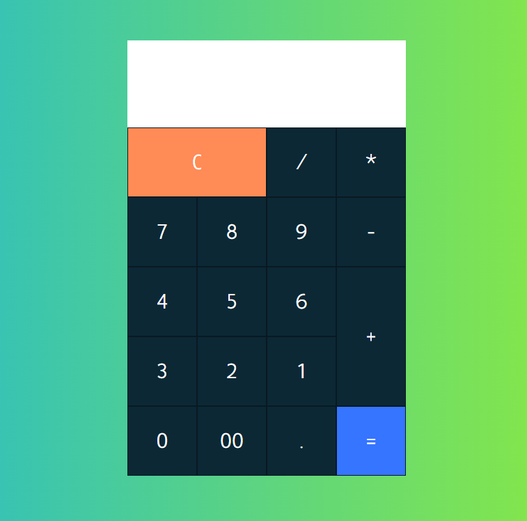

# Calculator without JS

I try to create my first calculator without Javascript

Version 1.0.0

## Create with:

- HTML5
- CSS3

## Description: :clipboard:

Simple calculator that allows you to perform easy mathematical calculations. Try yourself, perform an addition,
substraction or division. The Result will be displayed on the white screen, at the top of the calculator.

### License & Copyright :closed_lock_with_key:

© Fabio Ciampichetti, Start2Impact Web Developer Student

